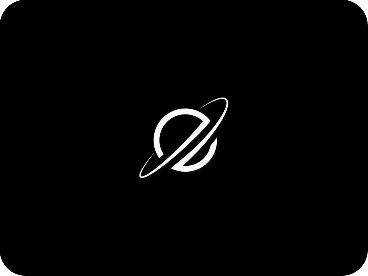

 

# 𝙼 𝙾 𝚁 𝚂 死 神

 
 

- Name: **M O R S 死 神**

- Location: **127.0.0.1**

- Field of Study: [**Computer Science**](https://stevejobs.academy/)

- Proficient in: **GNU/Linux**

- Mostly using:  **TypeScript** , **NestJS**

- Languages: Italian

 
 

---

 
 

 
 
  
 
 

  

  

